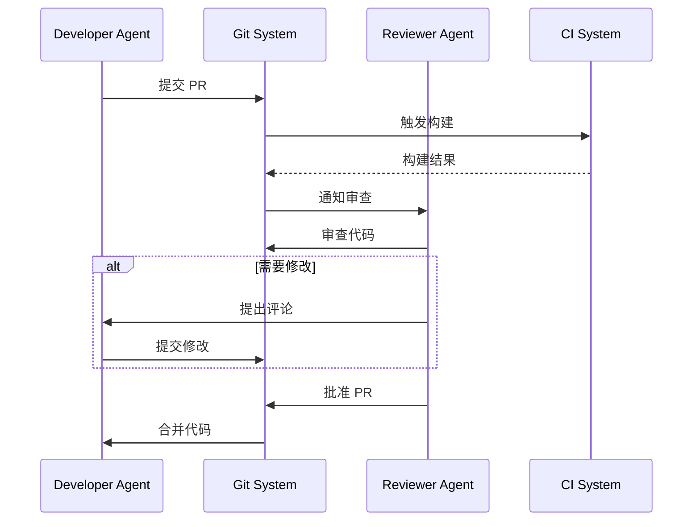

# 巡检宝项目 - Agent 开发统一规范

> 本规范定义了 Agent 间的通信语法、代码生成模板、工作流程和错误处理机制。
> **核心原则**: 统一、高效、可追溯、减少报错

---

## 一、Agent 通信协议

### 1.1 消息格式标准

所有 Agent 间的通信必须遵循以下 JSON 格式：

```json
{
  "type": "task|response|error|status",
  "action": "create|update|complete|fail|handoff",
  "from": "agent-name",
  "to": "agent-name|all",
  "payload": {
    "task_id": "唯一任务ID",
    "title": "任务标题",
    "description": "详细描述",
    "priority": "P0|P1|P2|P3",
    "status": "pending|in_progress|completed|failed",
    "artifacts": ["产出物列表"],
    "dependencies": ["前置任务ID"],
    "context": {
      "files": ["涉及的文件"],
      "requirements": ["需求列表"],
      "constraints": ["约束条件"]
    }
  },
  "metadata": {
    "timestamp": "ISO8601时间戳",
    "correlation_id": "关联ID，用于追踪",
    "reference": "引用消息ID"
  }
}
```

### 1.2 消息类型定义

| 类型 | 用途 | 示例 |
|------|------|------|
| `task` | 任务分配 | project-lead → backend-dev |
| `response` | 任务响应 | backend-dev → project-lead |
| `error` | 错误报告 | backend-dev → frontend-lead |
| `status` | 状态更新 | backend-dev → all |

### 1.3 任务交接协议 (Handoff)

当任务需要从一个 Agent 转移到另一个 Agent 时，必须遵循以下格式：

```json
{
  "type": "handoff",
  "from": "frontend-dev",
  "to": "backend-lead",
  "payload": {
    "task_id": "TASK-2024-001",
    "handoff_reason": "需要API接口设计",
    "completed_work": [
      "设计完成前端组件结构",
      "定义 Props 接口"
    ],
    "remaining_work": [
      "设计 RESTful API",
      "定义数据模型"
    ],
    "artifacts": [
      "/app/src/components/UserCard.tsx",
      "/app/src/api/user.ts"
    ],
    "questions": [
      "是否需要分页？",
      "排序字段有哪些？"
    ],
    "context": {
      "original_requirement": "用户想要查看用户列表",
      "tech_stack": "React + TypeScript",
      "api_pattern": "REST"
    }
  }
}
```

### 1.4 错误报告标准

```json
{
  "type": "error",
  "from": "frontend-dev",
  "to": "frontend-lead",
  "payload": {
    "error_code": "ERR_FILE_NOT_FOUND",
    "error_message": "无法找到组件文件",
    "severity": "P0|P1|P2",
    "file": "/app/src/components/Button.tsx",
    "line": 42,
    "stack_trace": "...",
    "suggested_fix": "检查文件路径是否正确"
  }
}
```

---

## 二、代码生成模板

### 2.1 Go 后端文件模板

#### Handler 层模板

```go
// Package: handler
// File: {entity}_handler.go
// Generated by: {agent-name}
// Date: {timestamp}

package handler

import (
    "net/http"
    "github.com/gin-gonic/gin"
    "xunjianbao/backend/internal/service"
    "xunjianbao/backend/pkg/response"
)

type {Entity}Handler struct {
    svc *service.{Entity}Service
}

func New{Entity}Handler(svc *service.{Entity}Service) *{Entity}Handler {
    return &{Entity}Handler{svc: svc}
}

// @Summary 获取{Entity}列表
// @Description 获取分页的{Entity}列表
// @Tags {Entity}
// @Accept json
// @Produce json
// @Param page query int false "页码" default(1)
// @Param page_size query int false "每页数量" default(20)
// @Security BearerAuth
// @Success 200 {object} response.Response{data=[]model.{Entity}}
// @Router /api/v1/{entities} [get]
func (h *{Entity}Handler) List(c *gin.Context) {
    var req struct {
        Page     int `form:"page" binding:"min=1"`
        PageSize int `form:"page_size" binding:"min=1,max=100"`
    }

    if err := c.ShouldBindQuery(&req); err != nil {
        response.BadRequest(c, err.Error())
        return
    }

    if req.Page == 0 {
        req.Page = 1
    }
    if req.PageSize == 0 {
        req.PageSize = 20
    }

    ctx := c.Request.Context()
    result, err := h.svc.List(ctx, req.Page, req.PageSize)
    if err != nil {
        response.InternalError(c, err.Error())
        return
    }

    response.Success(c, result)
}

// @Summary 创建{Entity}
// @Description 创建新的{Entity}
// @Tags {Entity}
// @Accept json
// @Produce json
// @Param body body model.Create{Entity}Request true "创建请求"
// @Security BearerAuth
// @Success 201 {object} response.Response
// @Router /api/v1/{entities} [post]
func (h *{Entity}Handler) Create(c *gin.Context) {
    var req model.Create{Entity}Request
    if err := c.ShouldBindJSON(&req); err != nil {
        response.BadRequest(c, err.Error())
        return
    }

    ctx := c.Request.Context()
    result, err := h.svc.Create(ctx, &req)
    if err != nil {
        response.InternalError(c, err.Error())
        return
    }

    response.Created(c, result)
}
```

#### Service 层模板

```go
// Package: service
// File: {entity}_service.go
// Generated by: {agent-name}
// Date: {timestamp}

package service

import (
    "context"
    "xunjianbao/backend/internal/model"
    "xunjianbao/backend/internal/repository"
)

type {Entity}Service struct {
    repo *repository.{Entity}Repository
}

func New{Entity}Service(repo *repository.{Entity}Repository) *{Entity}Service {
    return &{Entity}Service{repo: repo}
}

func (s *{Entity}Service) List(ctx context.Context, page, pageSize int) ([]model.{Entity}, error) {
    offset := (page - 1) * pageSize
    return s.repo.List(ctx, pageSize, offset)
}

func (s *{Entity}Service) Create(ctx context.Context, req *model.Create{Entity}Request) (*model.{Entity}, error) {
    entity := &model.{Entity}{
        Name: req.Name,
    }
    return s.repo.Create(ctx, entity)
}
```

#### Repository 层模板

```go
// Package: repository
// File: {entity}_repository.go
// Generated by: {agent-name}
// Date: {timestamp}

package repository

import (
    "context"
    "xunjianbao/backend/internal/model"
    "gorm.io/gorm"
)

type {Entity}Repository struct {
    db *gorm.DB
}

func New{Entity}Repository(db *gorm.DB) *{Entity}Repository {
    return &{Entity}Repository{db: db}
}

func (r *{Entity}Repository) List(ctx context.Context, limit, offset int) ([]model.{Entity}, error) {
    var entities []model.{Entity}
    err := r.db.WithContext(ctx).
        Order("created_at DESC").
        Limit(limit).
        Offset(offset).
        Find(&entities).Error
    return entities, err
}

func (r *{Entity}Repository) Create(ctx context.Context, entity *model.{Entity}) (*model.{Entity}, error) {
    err := r.db.WithContext(ctx).Create(entity).Error
    return entity, err
}
```

#### Model 层模板

```go
// Package: model
// File: {entity}.go
// Generated by: {agent-name}
// Date: {timestamp}

package model

import (
    "time"
)

type {Entity} struct {
    ID        uint64     `gorm:"primarykey" json:"id"`
    CreatedAt time.Time  `json:"created_at"`
    UpdatedAt time.Time  `json:"updated_at"`
    DeletedAt *time.Time `gorm:"index" json:"-"`

    Name     string `gorm:"size:255;not null" json:"name"`
    Status   string `gorm:"size:32;default:active" json:"status"`
    TenantID string `gorm:"size:64;not null;index" json:"tenant_id"`
}

func ({Entity}) TableName() string {
    return "{entities}"
}

type Create{Entity}Request struct {
    Name string `json:"name" binding:"required,min=1,max=255"`
}

type Update{Entity}Request struct {
    Name string `json:"name" binding:"omitempty,min=1,max=255"`
    Status string `json:"status" binding:"omitempty,oneof=active inactive"`
}
```

### 2.2 React/TypeScript 前端文件模板

#### 组件模板

```typescript
// File: {ComponentName}.tsx
// Generated by: {agent-name}
// Date: {timestamp}

import React, { useState, useCallback, useMemo } from 'react';
import { Button } from '@/components/ui/button';
import { Card } from '@/components/ui/card';
import { Input } from '@/components/ui/input';
import { useToast } from '@/components/ui/use-toast';

interface {ComponentName}Props {
  /** 标题 */
  title?: string;
  /** 数据源 */
  data: {DataType}[];
  /** 点击回调 */
  onClick?: (item: {DataType}) => void;
  /** 是否加载中 */
  loading?: boolean;
  /** 类名 */
  className?: string;
}

export const {ComponentName}: React.FC<{ComponentName}Props> = ({
  title = '默认标题',
  data,
  onClick,
  loading = false,
  className = ''
}) => {
  const { toast } = useToast();
  const [searchTerm, setSearchTerm] = useState('');

  const filteredData = useMemo(() => {
    if (!searchTerm) return data;
    return data.filter(item =>
      item.name.toLowerCase().includes(searchTerm.toLowerCase())
    );
  }, [data, searchTerm]);

  const handleItemClick = useCallback((item: {DataType}) => {
    if (onClick) {
      onClick(item);
    }
  }, [onClick]);

  if (loading) {
    return (
      <Card className={`p-4 ${className}`}>
        <div className="animate-pulse space-y-4">
          <div className="h-4 bg-gray-200 rounded w-1/4" />
          <div className="space-y-2">
            <div className="h-3 bg-gray-200 rounded" />
            <div className="h-3 bg-gray-200 rounded w-5/6" />
          </div>
        </div>
      </Card>
    );
  }

  return (
    <Card className={`p-4 ${className}`}>
      <div className="space-y-4">
        <div className="flex items-center justify-between">
          <h3 className="text-lg font-semibold">{title}</h3>
          <Input
            type="search"
            placeholder="搜索..."
            value={searchTerm}
            onChange={(e) => setSearchTerm(e.target.value)}
            className="w-64"
          />
        </div>

        <div className="space-y-2">
          {filteredData.map((item) => (
            <div
              key={item.id}
              className="p-3 border rounded-lg hover:bg-gray-50 cursor-pointer transition-colors"
              onClick={() => handleItemClick(item)}
            >
              <div className="font-medium">{item.name}</div>
              <div className="text-sm text-gray-500">{item.description}</div>
            </div>
          ))}
        </div>
      </div>
    </Card>
  );
};

{CustomHooks}

export default {ComponentName};
```

#### API 文件模板

```typescript
// File: api/{resource}.ts
// Generated by: {agent-name}
// Date: {timestamp}

import { client } from './client';
import type { ApiResponse, PaginatedResponse } from './types';

export interface {Resource} {
  id: string;
  name: string;
  status: 'active' | 'inactive';
  created_at: string;
  updated_at: string;
}

export interface Create{Resource}Request {
  name: string;
}

export interface Update{Resource}Request {
  name?: string;
  status?: 'active' | 'inactive';
}

export interface {Resource}ListParams {
  page?: number;
  page_size?: number;
  search?: string;
}

export const {resource}Api = {
  list: async (params?: {Resource}ListParams): Promise<PaginatedResponse<{Resource}>> => {
    const { data } = await client.get<PaginatedResponse<{Resource}>>('/api/v1/{resources}', { params });
    return data;
  },

  get: async (id: string): Promise<ApiResponse<{Resource}>> => {
    const { data } = await client.get<ApiResponse<{Resource}>>(`/api/v1/{resources}/${id}`);
    return data;
  },

  create: async (payload: Create{Resource}Request): Promise<ApiResponse<{Resource}>> => {
    const { data } = await client.post<ApiResponse<{Resource}>>('/api/v1/{resources}', payload);
    return data;
  },

  update: async (id: string, payload: Update{Resource}Request): Promise<ApiResponse<{Resource}>> => {
    const { data } = await client.put<ApiResponse<{Resource}>>(`/api/v1/{resources}/${id}`, payload);
    return data;
  },

  delete: async (id: string): Promise<ApiResponse<null>> => {
    const { data } = await client.delete<ApiResponse<null>>(`/api/v1/{resources}/${id}`);
    return data;
  },
};
```

### 2.3 Python AI 服务文件模板

#### API 路由模板

```python
# File: app/api/{module}_router.py
# Generated by: {agent-name}
# Date: {timestamp}

from fastapi import APIRouter, Depends, HTTPException, UploadFile, File
from typing import List, Optional
from pydantic import BaseModel, Field

router = APIRouter(prefix="/api/v1/{module}", tags=["{Module}"])

class {Model}Request(BaseModel):
    name: str = Field(..., min_length=1, max_length=255)
    config: Optional[dict] = None

class {Model}Response(BaseModel):
    id: str
    name: str
    status: str
    created_at: str

    class Config:
        from_attributes = True

@router.get("/", response_model=List[{Model}Response])
async def list_{module}(
    skip: int = 0,
    limit: int = 100,
    current_user = Depends(get_current_user)
):
    """获取{module}列表"""
    results = await {module}_service.list(skip=skip, limit=limit)
    return results

@router.post("/", response_model={Model}Response, status_code=201)
async def create_{module}(
    request: {Model}Request,
    current_user = Depends(get_current_user)
):
    """创建{module}"""
    result = await {module}_service.create(request.dict())
    return result

@router.get("/{module}_id", response_model={Model}Response)
async def get_{module}(
    {module}_id: str,
    current_user = Depends(get_current_user)
):
    """获取单个{module}"""
    result = await {module}_service.get({module}_id)
    if not result:
        raise HTTPException(status_code=404, detail="{Module} not found")
    return result
```

#### Service 层模板

```python
# File: app/services/{module}_service.py
# Generated by: {agent-name}
# Date: {timestamp}

from typing import List, Optional
from app.models.{module} import {Model}
from app.schemas.{module}_schema import {Model}Request, {Model}Response
from app.core.database import get_db
import asyncio

class {Model}Service:
    def __init__(self):
        self.cache = {}

    async def list(self, skip: int = 0, limit: int = 100) -> List[{Model}Response]:
        """获取{module}列表"""
        db = await get_db()
        try:
            results = await db.fetch_all(
                f"SELECT * FROM {module}s ORDER BY created_at DESC LIMIT $1 OFFSET $2",
                limit, skip
            )
            return [self._to_response(r) for r in results]
        finally:
            await db.close()

    async def create(self, data: dict) -> {Model}Response:
        """创建{module}"""
        db = await get_db()
        try:
            query = """
                INSERT INTO {module}s (name, config, created_at)
                VALUES ($1, $2, NOW())
                RETURNING *
            """
            result = await db.fetch_one(query, data['name'], data.get('config'))
            return self._to_response(result)
        finally:
            await db.close()

    async def get(self, {module}_id: str) -> Optional[{Model}Response]:
        """获取单个{module}"""
        if {module}_id in self.cache:
            return self.cache[{module}_id]

        db = await get_db()
        try:
            result = await db.fetch_one(
                "SELECT * FROM {module}s WHERE id = $1",
                {module}_id
            )
            if result:
                response = self._to_response(result)
                self.cache[{module}_id] = response
                return response
            return None
        finally:
            await db.close()

    def _to_response(self, row) -> {Model}Response:
        """转换为响应模型"""
        return {Model}Response(
            id=str(row['id']),
            name=row['name'],
            status=row.get('status', 'active'),
            created_at=row['created_at'].isoformat()
        )
```

---

## 三、工作流程规范

### 3.1 Agent 协作流程图

```
用户请求
    ↓
skill-dispatcher 分析任务类型
    ↓
project-lead 规划任务
    ↓
    ├─→ frontend-lead 设计架构
    │       ↓
    │   frontend-dev 实现
    │       ↓
    │   frontend-lead 审查
    │
    ├─→ backend-lead 设计 API
    │       ↓
    │   backend-dev 实现
    │       ↓
    │   backend-lead 审查
    │
    └─→ ai-lead 设计方案
            ↓
        openclaw-eng 实现
            ↓
        ai-lead 审查
```

### 3.2 任务创建标准

每个任务必须包含以下信息：

```json
{
  "task_id": "XJ-2024-001",
  "title": "[功能名称] - 简短描述",
  "description": "详细的需求描述...",
  "acceptance_criteria": [
    "✓ 验收标准1",
    "✓ 验收标准2",
    "✓ 验收标准3"
  ],
  "priority": "P0|P1|P2|P3",
  "estimated_hours": 8,
  "dependencies": ["前置任务ID"],
  "assignee": "agent-name",
  "reviewer": "agent-name",
  "labels": ["frontend", "api", "urgent"]
}
```

### 3.3 代码审查流程



### 3.4 代码审查检查清单

#### 功能性检查 ✅
- [ ] 代码符合需求
- [ ] 边界条件处理
- [ ] 错误处理完善
- [ ] 无明显 Bug

#### 安全性检查 🔒
- [ ] 无 SQL 注入风险
- [ ] 无 XSS 风险
- [ ] 敏感信息脱敏
- [ ] 权限检查到位

#### 性能检查 ⚡
- [ ] 无 N+1 查询
- [ ] 无内存泄漏
- [ ] 算法复杂度合理
- [ ] 资源正确释放

#### 规范检查 📝
- [ ] 命名清晰
- [ ] 注释必要
- [ ] 代码可测试
- [ ] 符合项目规范

---

## 四、错误处理机制

### 4.1 错误码体系

| 错误码 | 含义 | 严重程度 | 处理方式 |
|--------|------|----------|----------|
| `ERR_{CATEGORY}_001` | 参数错误 | P3 | 返回 400，提示用户 |
| `ERR_{CATEGORY}_002` | 认证失败 | P2 | 返回 401，提示登录 |
| `ERR_{CATEGORY}_003` | 权限不足 | P2 | 返回 403，提示权限 |
| `ERR_{CATEGORY}_004` | 资源不存在 | P3 | 返回 404，提示不存在 |
| `ERR_{CATEGORY}_005` | 业务错误 | P2 | 返回 500，记录日志 |
| `ERR_{CATEGORY}_006` | 系统错误 | P1 | 返回 500，告警通知 |
| `ERR_{CATEGORY}_007` | 外部服务错误 | P1 | 返回 502，降级处理 |

### 4.2 错误响应格式

#### Go 错误响应

```go
// Package: response
// File: error.go

package response

type ErrorResponse struct {
    Code    int    `json:"code"`
    Message string `json:"message"`
    Details string `json:"details,omitempty"`
    TraceID string `json:"trace_id,omitempty"`
}

const (
    // 参数错误
    ErrCodeInvalidParams = 400001

    // 认证错误
    ErrCodeUnauthorized  = 401001
    ErrCodeTokenExpired  = 401002

    // 权限错误
    ErrCodeForbidden     = 403001

    // 资源错误
    ErrCodeNotFound      = 404001

    // 业务错误
    ErrCodeBusiness      = 500001
    ErrCodeInternal      = 500002

    // 外部错误
    ErrCodeExternal      = 502001
)

func Error(c *gin.Context, code int, message string, details string) {
    c.JSON(code, ErrorResponse{
        Code:    code,
        Message: message,
        Details: details,
        TraceID: c.GetString("trace_id"),
    })
}
```

#### TypeScript 错误类型

```typescript
// File: api/errors.ts

export class ApiError extends Error {
  constructor(
    public readonly code: number,
    public readonly message: string,
    public readonly details?: string,
    public readonly traceId?: string
  ) {
    super(message);
    this.name = 'ApiError';
  }
}

export class NetworkError extends ApiError {
  constructor(message: string = '网络连接失败') {
    super(0, message);
    this.name = 'NetworkError';
  }
}

export class ValidationError extends ApiError {
  constructor(message: string, details?: string) {
    super(400, message, details);
    this.name = 'ValidationError';
  }
}

export class AuthError extends ApiError {
  constructor(message: string = '认证失败') {
    super(401, message);
    this.name = 'AuthError';
  }
}

export class PermissionError extends ApiError {
  constructor(message: string = '权限不足') {
    super(403, message);
    this.name = 'PermissionError';
  }
}
```

### 4.3 全局错误处理

#### Go Gin 中间件

```go
// Package: middleware
// File: error_handler.go

func ErrorHandler() gin.HandlerFunc {
    return func(c *gin.Context) {
        defer func() {
            if err := recover(); err != nil {
                log.Error("panic recovered", zap.Any("error", err))
                response.InternalError(c, "系统错误")
                c.Abort()
            }
        }()
        c.Next()
    }
}
```

#### React Error Boundary

```typescript
// File: components/ErrorBoundary.tsx

import React, { Component, ErrorInfo, ReactNode } from 'react';
import { Button } from './ui/button';
import { Card } from './ui/card';

interface Props {
  children: ReactNode;
  fallback?: ReactNode;
}

interface State {
  hasError: boolean;
  error: Error | null;
}

export class ErrorBoundary extends Component<Props, State> {
  public state: State = {
    hasError: false,
    error: null,
  };

  public static getDerivedStateFromError(error: Error): State {
    return { hasError: true, error };
  }

  public componentDidCatch(error: Error, errorInfo: ErrorInfo) {
    console.error('ErrorBoundary caught an error:', error, errorInfo);
  }

  private handleReset = () => {
    this.setState({ hasError: false, error: null });
  };

  public render() {
    if (this.state.hasError) {
      if (this.props.fallback) {
        return this.props.fallback;
      }

      return (
        <Card className="p-6 text-center">
          <h2 className="text-xl font-semibold text-red-600 mb-2">
            出错了
          </h2>
          <p className="text-gray-600 mb-4">
            {this.state.error?.message || '发生了未知错误'}
          </p>
          <Button onClick={this.handleReset}>
            重试
          </Button>
        </Card>
      );
    }

    return this.props.children;
  }
}
```

---

## 五、状态管理规范

### 5.1 任务状态机

```
   ┌─────────┐
   │ pending │  ← 新建任务
   └────┬────┘
        ↓
   ┌────▼────┐
   │blocked  │  ← 等待依赖
   └────┬────┘
        ↓
   ┌────▼────┐
   │in_progress│ ← 开始执行
   └────┬────┘
        ↓
   ┌────▼────┐
   │ waiting_review│ ← 待审查
   └────┬────┘
        ↓
   ┌────▼────┐     ┌───────┐
   │approved │────→│ merged│
   └────┬────┘     └───────┘
        ↓
   ┌────▼────┐
   │changes_requested│ ← 需要修改
   └────┬────┘
        ↓
        └──────────→ in_progress
```

### 5.2 状态追踪格式

```json
{
  "task_id": "XJ-2024-001",
  "status_history": [
    {
      "status": "pending",
      "timestamp": "2024-03-15T10:00:00Z",
      "actor": "project-lead",
      "comment": "任务创建"
    },
    {
      "status": "in_progress",
      "timestamp": "2024-03-15T10:30:00Z",
      "actor": "backend-dev",
      "comment": "开始实现"
    },
    {
      "status": "waiting_review",
      "timestamp": "2024-03-15T14:00:00Z",
      "actor": "backend-dev",
      "comment": "提交代码审查",
      "artifacts": ["PR #123"]
    }
  ],
  "current_status": "waiting_review",
  "updated_at": "2024-03-15T14:00:00Z"
}
```

---

## 六、日志规范

### 6.1 日志格式

```json
{
  "timestamp": "2024-03-15T10:30:00.123Z",
  "level": "INFO|WARN|ERROR|DEBUG",
  "service": "backend|frontend|ai",
  "trace_id": "trace-uuid",
  "span_id": "span-uuid",
  "agent": "agent-name",
  "task_id": "XJ-2024-001",
  "message": "日志消息",
  "context": {
    "user_id": "user-123",
    "action": "create_user",
    "duration_ms": 150
  },
  "error": {
    "code": "ERR_DB_001",
    "stack": "..."
  }
}
```

### 6.2 日志级别使用

| 级别 | 使用场景 | 示例 |
|------|----------|------|
| DEBUG | 开发调试 | `变量值`, `函数调用` |
| INFO | 正常流程 | `用户登录`, `订单创建` |
| WARN | 异常但不阻断 | `参数为空`, `重试中` |
| ERROR | 错误需关注 | `数据库连接失败`, `认证失败` |

---

## 七、API 规范

### 7.1 URL 设计规范

```
资源命名:
  - 使用复数名词: /users, /streams
  - 使用 kebab-case: /video-streams
  - 嵌套资源限制3层: /users/{id}/streams/{id}/alerts

动作映射:
  GET    /resources        → 列表
  GET    /resources/:id    → 单个
  POST   /resources        → 创建
  PUT    /resources/:id    → 更新
  DELETE /resources/:id    → 删除
  POST   /resources/:id/action → 动作
```

### 7.2 请求响应格式

```typescript
// 请求
interface ApiRequest<T = unknown> {
  headers?: Record<string, string>;
  params?: Record<string, string | number>;
  body?: T;
  timeout?: number;
}

// 响应
interface ApiResponse<T = unknown> {
  code: number;
  message: string;
  data: T;
  timestamp: string;
  trace_id?: string;
}

// 分页响应
interface PaginatedResponse<T> extends ApiResponse<T[]> {
  pagination: {
    page: number;
    page_size: number;
    total: number;
    total_pages: number;
  };
}
```

---

## 八、禁止事项

```yaml
Agent 开发禁止:
  ❌ 禁止 Agent 间直接修改对方代码（必须通过 PR）
  ❌ 禁止跳过代码审查
  ❌ 禁止硬编码配置
  ❌ 禁止提交敏感信息
  ❌ 禁止循环内数据库查询
  ❌ 禁止不处理的 error
  ❌ 禁止使用 any 类型（TypeScript）
  ❌ 禁止使用 * 作为泛型参数

代码质量禁止:
  ❌ 禁止 SELECT *
  ❌ 禁止隐式 JOIN
  ❌ 禁止深度分页（offset > 1000）
  ❌ 禁止无索引的外键
  ❌ 禁止类组件（React）
  ❌ 禁止在 render 中执行副作用

规范遵守:
  ❌ 禁止不遵循消息格式
  ❌ 禁止不记录日志
  ❌ 禁止不处理异常
  ❌ 禁止不使用统一模板
```

---

## 九、模板变量速查表

| 变量 | 替换内容 | 示例 |
|------|----------|------|
| `{Entity}` | 实体名称（大写） | `User`, `VideoStream` |
| `{entity}` | 实体名称（小写） | `user`, `video_stream` |
| `{entities}` | 实体复数 | `users`, `video_streams` |
| `{ComponentName}` | 组件名称 | `UserCard`, `StreamList` |
| `{Module}` | 模块名称 | `Detection`, `Analysis` |
| `{Model}` | 数据模型 | `UserModel`, `DetectionModel` |
| `{agent-name}` | Agent 名称 | `backend-dev` |
| `{timestamp}` | ISO8601 时间 | `2024-03-15T10:00:00Z` |
| `{resource}` | 资源名称 | `stream`, `alert` |
| `{resources}` | 资源复数 | `streams`, `alerts` |

---

## 十、快速参考卡

### 任务创建

```bash
# 使用标准模板
{
  "task_id": "XJ-2024-XXX",
  "title": "[功能] - 简短描述",
  "acceptance_criteria": ["✓ 标准1", "✓ 标准2"],
  "priority": "P0|P1|P2|P3",
  "assignee": "@agent-name"
}
```

### 消息发送

```bash
# 发送任务
{ "type": "task", "action": "create", "from": "agent", "to": "agent", "payload": {...} }

# 状态更新
{ "type": "status", "from": "agent", "to": "all", "payload": { "task_id": "...", "status": "..." } }

# 错误报告
{ "type": "error", "from": "agent", "to": "lead", "payload": { "error_code": "...", "severity": "..." } }
```

### 代码生成

```bash
# Go Handler: {entity}_handler.go
# Go Service: {entity}_service.go
# Go Repository: {entity}_repository.go
# Go Model: {entity}.go
# React Component: {ComponentName}.tsx
# React API: api/{resource}.ts
# Python Router: app/api/{module}_router.py
# Python Service: app/services/{module}_service.py
```

---

**最后更新**: 2026年4月
