# 巡检宝 (XunJianBao)

> 面向重工业企业的智能监控平台，通过 OpenClaw AI Agent 和 YOLO 检测，让监控从"被动观看"升级为"主动思考"。

---

## 目标与范围

巡检宝是一个针对重工业场景设计的全链路智能监控 SaaS 平台。项目核心价值在于将传统被动式视频监控升级为主动智能巡检体系，通过 AI Agent（OpenClaw）与计算机视觉（YOLOv8）的深度融合，实现火灾、入侵、设备缺陷等异常事件的自动识别、告警推送和智能报告生成。

平台面向的目标用户包括重工业园区安全管理部门、巡检运维人员和企业管理层。系统采用多租户隔离架构，支持企业级权限管理与数据安全，可同时服务多家企业。

核心能力覆盖六大模块：多画面实时视频监控（数据大屏）、企业级媒体文件管理（媒体库）、多协议视频流接入、YOLO 智能检测、OpenClaw AI 协同（对话/报告/诊断）、以及全链路告警管理。

---

## 技术栈

| 类别 | 技术 | 用途 |
|------|------|------|
| **前端语言** | TypeScript 5.0 | 全前端开发语言，严格模式 |
| **前端框架** | React 18 | SPA 应用框架 |
| **前端构建** | Vite 4 + pnpm | 开发服务器与打包 |
| **状态管理** | Redux Toolkit + RTK Query | 全局状态与 API 缓存 |
| **UI 样式** | Tailwind CSS 3 + Radix UI | 原子化 CSS + 无障碍组件 |
| **动画** | Framer Motion | 页面过渡与微交互 |
| **后端语言** | Go 1.23 | API Gateway 与业务服务 |
| **后端框架** | Gin | HTTP 路由与中间件 |
| **ORM** | GORM | 数据库操作抽象层 |
| **认证** | JWT (golang-jwt/v5) | 用户认证与授权 |
| **实时通信** | gorilla/websocket | WebSocket 推送 |
| **数据库** | MySQL 8.0 / SQLite（开发） | 主数据存储 |
| **缓存** | Redis 7 | 会话缓存与热数据 |
| **AI 服务** | Python 3.10 + FastAPI | AI 推理网关 |
| **检测引擎** | YOLOv8 (ultralytics) + OpenCV | 目标检测与图像处理 |
| **AI Agent** | OpenClaw | 智能对话与任务编排 |
| **监控指标** | Prometheus | 服务可观测性 |
| **容器化** | Docker + Docker Compose | 开发与部署环境 |
| **CI/CD** | GitHub Actions | 持续集成与部署 |
| **反向代理** | Nginx | 前端静态资源服务与 API 代理 |
| **测试（前端）** | Vitest + Testing Library | 单元测试与组件测试 |
| **测试（后端）** | Go testing + benchmark | 单元/集成/性能测试 |

---

## 仓库结构

```mermaid
graph TD
    Root["xunjianbao/"]
    Root --> FE["frontend/<br/>React 18 + TypeScript + Tailwind"]
    Root --> BE["backend/<br/>Go + Gin + GORM"]
    Root --> AI["ai-service/<br/>Python + FastAPI"]
    Root --> YOLO["yolo-service/<br/>Python + YOLOv8"]
    Root --> Deploy["deploy/<br/>Dockerfile + nginx"]
    Root --> Scripts["scripts/<br/>运维脚本"]
    Root --> Config["config/"]
    Root --> Docs["docs/"]
    Root --> GH[".github/workflows/<br/>CI/CD"]
    Root --> DC["docker-compose.yaml"]

    FE --> FE_SRC["src/"]
    FE_SRC --> FE_Routes["routes/ - 页面路由"]
    FE_SRC --> FE_Comp["components/ - 组件库"]
    FE_SRC --> FE_Store["store/ - Redux + API"]
    FE_SRC --> FE_Types["types/ - 类型定义"]
    FE_SRC --> FE_Hooks["hooks/ - 自定义 Hooks"]

    BE --> BE_CMD["cmd/server/ - 入口"]
    BE --> BE_INT["internal/ - 核心业务"]
    BE --> BE_PKG["pkg/ - 公共库"]
    BE_INT --> BE_Handler["handler/ - API Handler"]
    BE_INT --> BE_Service["service/ - 业务逻辑"]
    BE_INT --> BE_Model["model/ - 数据模型"]
    BE_INT --> BE_MW["middleware/ - 中间件"]
    BE_INT --> BE_Router["router/ - 路由注册"]

    AI --> AI_API["app/api/ - API 路由"]
    AI --> AI_SVC["app/services/ - 服务层"]
    AI --> AI_MDL["app/models/ - Schema"]
```

---

## 核心系统总览

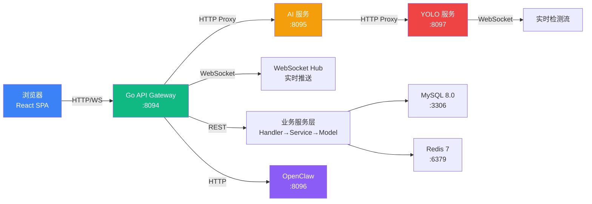

---

## 模块清单

| 模块 | 路径 | 职责 | 关键依赖 |
|------|------|------|----------|
| **前端 SPA** | `frontend/` | React 单页应用，8 个工作台模块 | React, Redux Toolkit, Tailwind, Vite |
| **Go API Gateway** | `backend/` | RESTful API、JWT 认证、WebSocket、路由 | Gin, GORM, gorilla/websocket |
| **AI 推理网关** | `ai-service/` | AI 聊天、智能分析、报告生成、YOLO 代理 | FastAPI, httpx, Pydantic |
| **YOLO 检测服务** | `yolo-service/` | YOLOv8 实时目标检测、WebSocket 流 | ultralytics, OpenCV, FastAPI |
| **部署配置** | `deploy/` | 前端 Docker 多阶段构建、Nginx 反向代理 | Docker, Nginx |
| **运维脚本** | `scripts/` | 部署、回滚、备份恢复、负载测试 | Bash |
| **CI/CD** | `.github/workflows/` | 持续集成、Docker 构建、自动部署 | GitHub Actions |

---

## 模块依赖架构

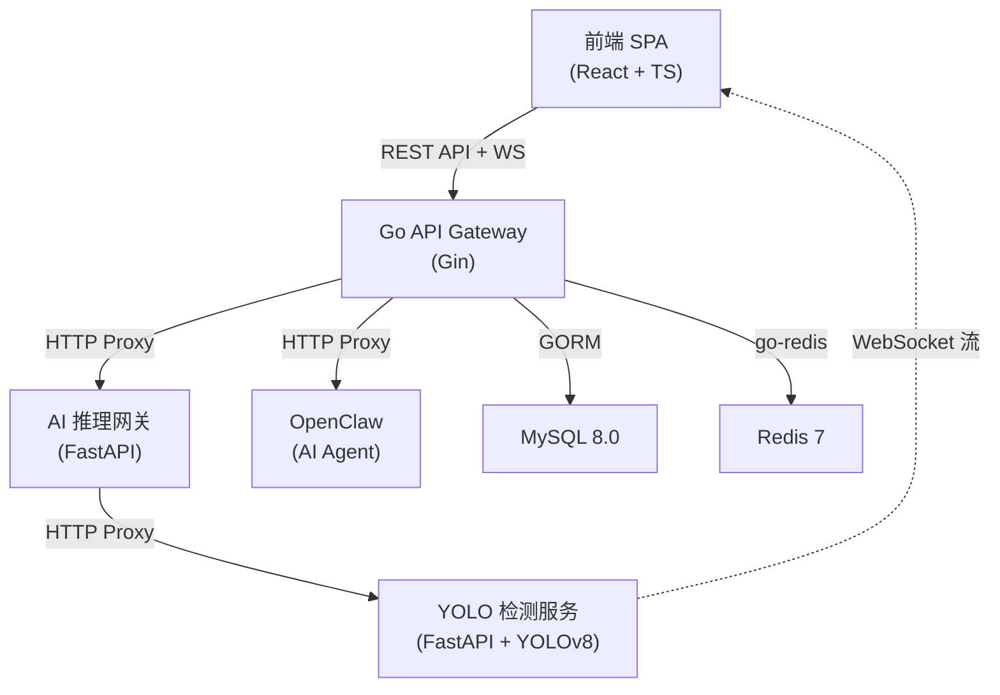

---

## 前端系统

<details>
<summary>相关源文件</summary>

- `frontend/src/main.tsx` - 应用入口，Provider 注册
- `frontend/src/router.tsx` - 路由配置，8 个工作台
- `frontend/src/components/Layout.tsx` - 全局布局，侧边栏+顶栏+OpenClaw面板
- `frontend/src/store/index.ts` - Redux Store 配置
- `frontend/src/store/api/baseApi.ts` - RTK Query 基础 API
- `frontend/src/config/navigation.ts` - 导航模块配置
- `frontend/src/api/client.ts` - HTTP 客户端封装
- `frontend/vite.config.ts` - Vite 构建配置
</details>

### 职责与边界

前端层负责所有用户交互界面的渲染与状态管理。采用 React 18 + TypeScript 严格模式开发，通过 Redux Toolkit 管理全局状态，RTK Query 处理所有 API 请求的缓存与生命周期。禁止使用 `any` 类型。

### 内部架构

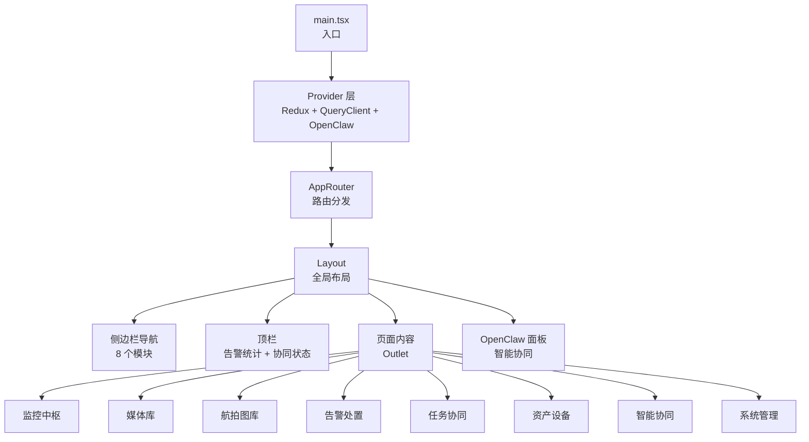

### 8 个工作台模块

| 模块 | 路由 | 组件 | 功能 |
|------|------|------|------|
| 监控中枢 | `/center` | `Center.tsx` | 多画面视频流实时监控、YOLO 检测叠加 |
| 媒体库 | `/media` | `Media.tsx` | 文件上传/下载、文件夹管理、收藏/回收站 |
| 航拍图库 | `/gallery` | `Gallery/index.tsx` | 航拍图片浏览、AI 分析、报告生成 |
| 告警处置 | `/alerts` | `AlertsWorkspace.tsx` | 告警列表、处置操作、统计分析 |
| 任务协同 | `/tasks` | `TasksWorkspace.tsx` | 巡检任务管理、分配、完成追踪 |
| 资产设备 | `/assets` | `AssetsWorkspace.tsx` | 传感器管理、设备台账、数据监控 |
| 智能协同 | `/openclaw` | `OpenClawWorkspace.tsx` | AI Agent 对话、任务编排、知识检索 |
| 系统管理 | `/system` | `SystemWorkspace.tsx` | 租户配置、功能开关、用户管理 |

### 状态管理

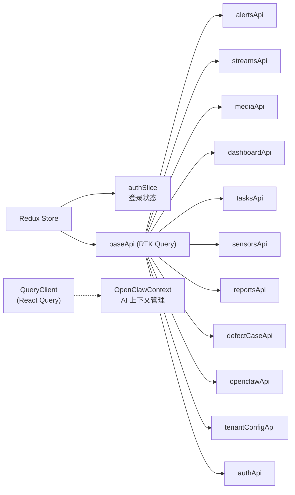

RTK Query 使用 `fetchBaseQuery` 作为基础查询函数，自动注入 `Authorization: Bearer <token>` 头部，定义了 18 个 Tag 类型用于缓存失效管理。

### 构建与优化

Vite 配置了手动代码分割策略：

| Chunk | 包含内容 |
|-------|---------|
| `vendor-react` | react, react-dom, react-router-dom |
| `vendor-redux` | @reduxjs/toolkit, react-redux |
| `vendor-ui` | Radix UI, cva, clsx, tailwind-merge |
| `vendor-motion` | framer-motion, lucide-react |
| `vendor-query` | @tanstack/react-query |

---

## Go API Gateway（后端）

<details>
<summary>相关源文件</summary>

- `backend/cmd/server/main.go` - 服务入口，数据库连接，自动迁移
- `backend/internal/router/router.go` - 路由注册，Service/Handler 初始化
- `backend/internal/config/config.go` - 环境变量配置加载
- `backend/internal/middleware/auth.go` - JWT 认证中间件
- `backend/internal/middleware/cors.go` - CORS 中间件
- `backend/internal/service/websocket.go` - WebSocket Hub
- `backend/pkg/config/env.go` - 环境检测（开发/生产）
- `backend/pkg/response/response.go` - 统一响应格式
- `backend/pkg/response/errors.go` - 错误码体系
</details>

### 职责与边界

Go 后端是整个系统的 API Gateway 与核心业务服务层。负责：JWT 认证授权、RESTful API 路由、WebSocket 实时推送、数据库 CRUD（通过 GORM）、以及向 AI Service / OpenClaw 的 HTTP 代理转发。

### 分层架构

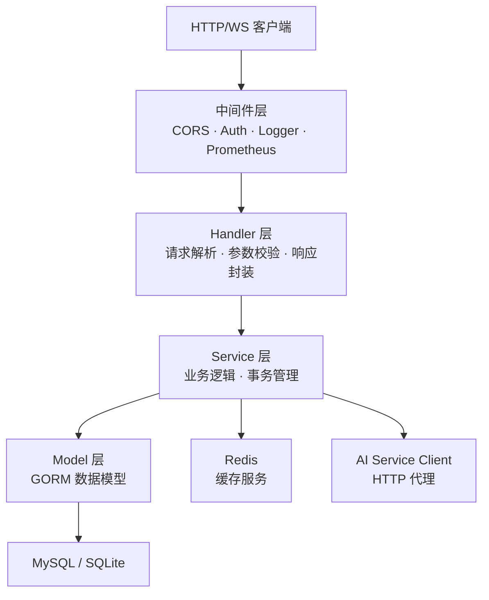

### 数据模型

| 模型 | 表名 | 说明 |
|------|------|------|
| `User` | `users` | 用户，含 TenantID 多租户隔离 |
| `Stream` | `streams` | 视频流，支持 camera/drone/rtsp/webrtc |
| `Alert` | `alerts` | 告警，分级 INFO/WARN/CRIT/OFFLINE |
| `Report` | `reports` | 巡检报告 |
| `Media` | `media` | 媒体文件，支持收藏/回收站/软删除 |
| `MediaFolder` | `media_folders` | 文件夹，树形结构 |
| `DefectCase` | `defect_cases` | 缺陷案例，含分类/严重度/状态机 |
| `DefectEvidence` | `defect_evidences` | 缺陷证据，含图像指纹去重 |
| `DuplicateGroup` | `duplicate_groups` | 重复组，phash/dhash/ssim/clip |
| `ReportDraft` | `report_drafts` | 报告草稿，支持 AI 生成与人工审核 |
| `YOLODetection` | - | YOLO 检测结果 |
| `Sensor` / `SensorData` | `sensors` | 传感器与数据时序 |
| `Task` | `tasks` | 巡检任务 |
| `TenantConfig` | `tenant_configs` | 租户配置 |
| `OnCallSchedule` / `OnCallReport` | - | 值班排班与报告 |
| `QAKnowledgeBase` / `QADocument` / `QAConversation` | - | QA 知识库 |

所有模型均包含 `TenantID` 字段实现多租户数据隔离。

### API 路由结构

```
/health                        GET     健康检查
/ws                            GET     WebSocket 实时连接

/api/v1/auth/login             POST    用户登录
/api/v1/auth/register          POST    用户注册

/api/v1/dashboard/*            GET     数据大屏统计
/api/v1/streams/*              CRUD    视频流管理
/api/v1/alerts/*               CRUD    告警管理
/api/v1/reports/*              CRUD    报告管理
/api/v1/ai/*                   POST    AI 分析/检测/聊天
/api/v1/oncall/*               CRUD    值班排班
/api/v1/qa/*                   CRUD    QA 知识库
/api/v1/tenant/*               CRUD    租户配置
/api/v1/sensors/*              CRUD    传感器管理
/api/v1/tasks/*                CRUD    巡检任务
/api/v1/media/*                CRUD    媒体文件管理
/api/v1/defect-cases/*         CRUD    缺陷案例管理
```

### 认证流程

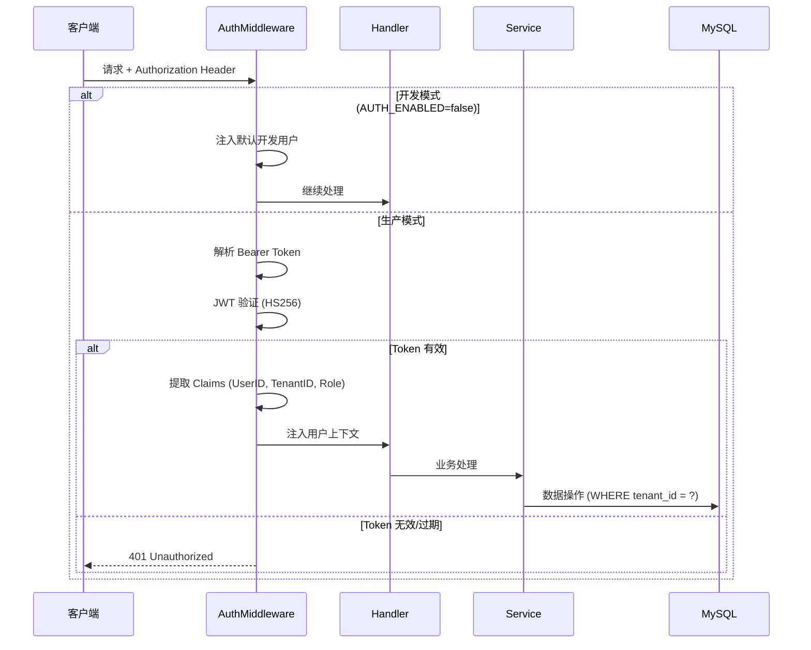

### 设计决策

- **开发模式旁路认证**：通过 `AUTH_ENABLED=false` 环境变量跳过 JWT 验证，注入默认 admin 用户，加速开发调试
- **SQLite 开发兼容**：当 `DATABASE_URL` 未设置时自动回退到 SQLite，零依赖启动
- **WebSocket Hub 模式**：采用 Go channel + goroutine 实现高并发广播，支持按租户定向推送

---

## AI 推理网关

<details>
<summary>相关源文件</summary>

- `ai-service/app/main.py` - FastAPI 主应用，API 路由定义
- `ai-service/app/services/yolo_proxy.py` - YOLO 检测代理
- `ai-service/app/services/chat_service.py` - AI 对话服务
- `ai-service/app/services/analysis_service.py` - 智能分析服务
- `ai-service/app/services/report_service.py` - 报告生成服务
- `ai-service/app/models/schemas.py` - Pydantic 数据模型
- `ai-service/app/middleware/upload_limit.py` - 上传限制中间件
</details>

### 职责与边界

AI 推理网关是连接 Go 后端与底层 YOLO 检测服务的中间层。负责：YOLO 检测请求代理转发、AI 聊天对话、智能分析（火灾/入侵/缺陷/设备/环境/告警）、巡检报告生成、以及 AI 模型管理。

### 系统架构

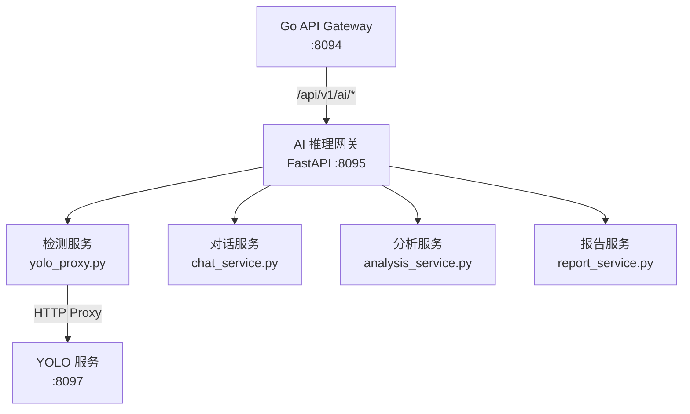

### API 端点

| 端点 | 方法 | 功能 |
|------|------|------|
| `/health` | GET | 健康检查（含 YOLO 服务状态） |
| `/api/v1/detect` | POST | YOLO 目标检测（stream_id） |
| `/api/v1/detect/image` | POST | 上传图片检测 |
| `/api/v1/detect/{stream_id}` | POST | 指定流检测 |
| `/api/v1/chat` | POST | AI 智能对话 |
| `/api/v1/analyze` | POST | 智能分析（6种类型） |
| `/api/v1/analyze-alert/{id}` | POST | 告警分析 |
| `/api/v1/diagnose-device/{id}` | POST | 设备诊断 |
| `/api/v1/reports/generate` | POST | 报告生成（5种类型） |
| `/api/v1/models` | GET | 可用模型列表 |
| `/api/v1/inspection` | GET | AI 巡检 |
| `/api/v1/predict/storage/{id}` | GET | 存储预测 |

### 设计决策

- **代理模式**：AI 网关不直接加载 YOLO 模型，而是通过 `httpx` 异步代理转发到独立的 YOLO 服务，实现关注点分离
- **单例服务**：所有服务类采用全局单例模式（`get_xxx_service()`），避免重复初始化
- **异步优先**：全部使用 `async/await` + `httpx.AsyncClient`，支持高并发

---

## YOLO 检测服务

<details>
<summary>相关源文件</summary>

- `yolo-service/app/main.py` - FastAPI 主应用，HTTP/WebSocket 端点
- `yolo-service/app/detector.py` - YOLODetector 核心检测类
- `yolo-service/app/models.py` - 数据模型定义
- `yolo-service/app/websocket_manager.py` - WebSocket 连接管理与流处理
- `yolo-service/app/middleware/upload_limit.py` - 上传限制
- `yolo-service/tests/test_detector.py` - 检测器单元测试
</details>

### 职责与边界

YOLO 检测服务是独立部署的计算密集型服务，封装 YOLOv8 模型推理能力。支持 HTTP 单帧检测和 WebSocket 实时流检测两种模式。

### 检测流程

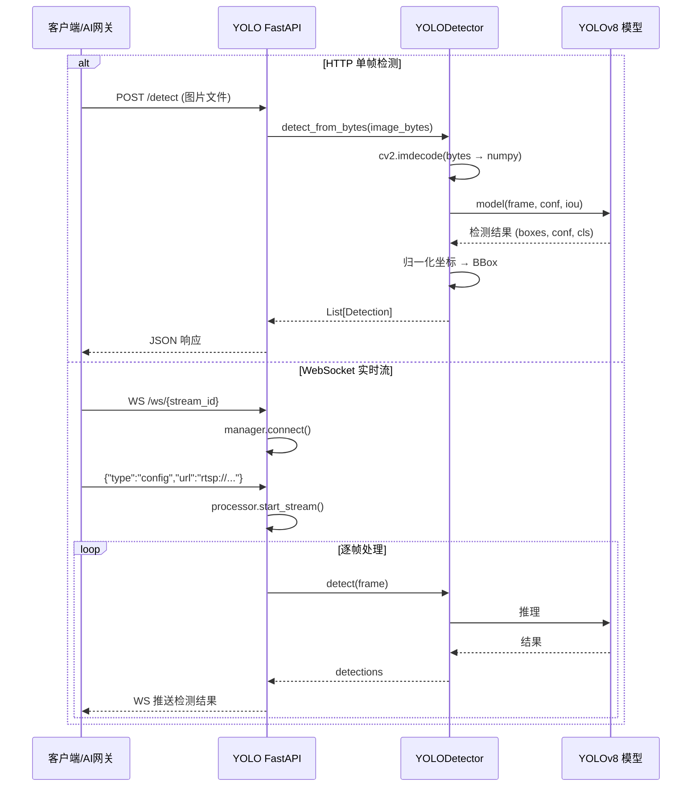

### 关键组件

| 组件 | 文件 | 职责 |
|------|------|------|
| `YOLODetector` | `detector.py` | 封装 YOLOv8 模型加载与推理，支持 CPU/CUDA/MPS |
| `WebSocketManager` | `websocket_manager.py` | 管理 WebSocket 连接生命周期 |
| `StreamProcessor` | `websocket_manager.py` | RTSP 流逐帧读取与检测调度 |

### 设计决策

- **坐标归一化**：所有检测结果的 BBox 坐标归一化到 [0, 1]，前端按视频实际尺寸还原
- **全局单例检测器**：通过 `init_detector()` / `get_detector()` 管理唯一的模型实例
- **设备可配**：通过 `DEVICE` 环境变量选择 cpu/cuda/mps，支持 Apple Silicon 和 GPU 加速

---

## WebSocket 实时推送系统

<details>
<summary>相关源文件</summary>

- `backend/internal/service/websocket.go` - Hub/Client/ReadPump/WritePump
- `backend/internal/handler/websocket.go` - WebSocket HTTP 升级 Handler
- `backend/internal/service/yolo_ws.go` - YOLO WebSocket 集成
- `frontend/src/lib/websocket.ts` - 前端 WebSocket 客户端
- `frontend/src/hooks/useWebSocket.ts` - React WebSocket Hook
</details>

### 系统架构

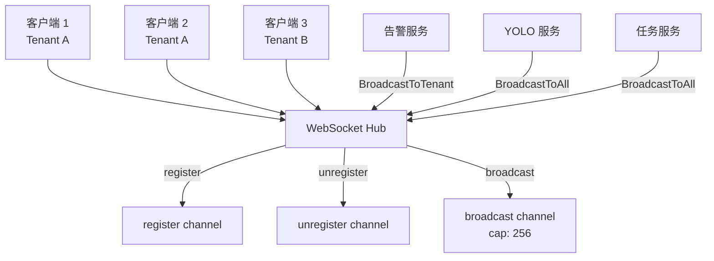

### 消息类型

| 类型 | 方向 | 说明 |
|------|------|------|
| `alert` | 服务端→客户端 | 新告警推送 |
| `yolo-detection` | 服务端→客户端 | YOLO 检测结果 |
| `stream-status` | 服务端→客户端 | 视频流状态变更 |
| `task-update` | 服务端→客户端 | 任务状态更新 |
| `ping` | 客户端→服务端 | 心跳探测 |
| `pong` | 服务端→客户端 | 心跳响应 |

消息统一格式：`{"type": string, "payload": object, "timestamp": string}`

### 设计决策

- **Hub-Spoke 模式**：中心化 Hub 通过 Go channel 协调所有连接，避免锁竞争
- **租户隔离推送**：`BroadcastToTenant()` 仅向同租户客户端推送，保证数据隔离
- **背压处理**：当客户端 Send channel 满时自动断开，防止慢消费者阻塞整个 Hub

---

## 缺陷案例管理系统

<details>
<summary>相关源文件</summary>

- `backend/internal/model/defect_case.go` - DefectCase/Evidence/DuplicateGroup/ReportDraft 模型
- `backend/internal/service/defect_case.go` - 缺陷案例业务逻辑（23KB）
- `backend/internal/handler/defect_case.go` - API Handler
- `frontend/src/components/media/DefectCaseMode.tsx` - 前端缺陷模式
- `frontend/src/components/media/EvidenceBoard.tsx` - 证据看板
- `frontend/src/components/media/CaseQueue.tsx` - 案例队列
- `frontend/src/store/api/defectCaseApi.ts` - RTK Query API
</details>

### 缺陷案例生命周期

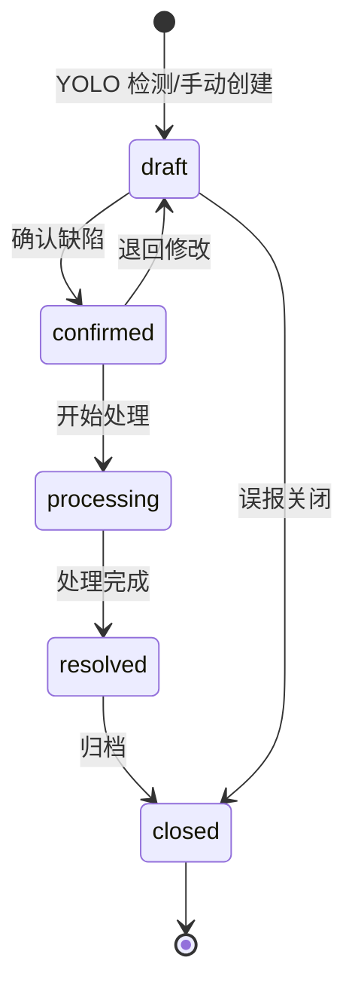

### 缺陷分类体系

| 一级分类 (Family) | 二级分类 (DefectType) |
|-------------------|----------------------|
| security（安防） | intrusion, fire |
| env（环境） | algae, leak |
| structure（结构） | crack, wall_damage, stair_damage |
| equipment（设备） | vehicle, personnel, other |

### 严重度

| 级别 | 含义 |
|------|------|
| `critical` | 紧急 - 需立即处理 |
| `high` | 高 - 需尽快处理 |
| `medium` | 中 - 常规处理 |
| `low` | 低 - 可延后处理 |

### 证据去重

系统支持多种图像去重算法：phash、dhash、ssim、clip、dino、siglip，通过 `DuplicateGroup` 管理重复证据的折叠展示。

---

## 媒体文件管理系统

<details>
<summary>相关源文件</summary>

- `backend/internal/model/media.go` - Media/MediaFolder 数据模型
- `backend/internal/service/media.go` - 媒体服务（13.6KB）
- `backend/internal/handler/media.go` - 媒体 API Handler（10.7KB）
- `frontend/src/routes/Media.tsx` - 媒体库主页面（68.4KB）
- `frontend/src/components/media/FileGrid.tsx` - 文件网格
- `frontend/src/components/media/FolderTree.tsx` - 文件夹树
- `frontend/src/components/media/FileUploader.tsx` - 文件上传
- `frontend/src/components/media/FilePreviewDialog.tsx` - 文件预览
- `frontend/src/store/api/mediaApi.ts` - RTK Query API
</details>

### 功能清单

| 功能 | API 端点 | 说明 |
|------|---------|------|
| 文件上传 | `POST /media/upload` | 支持多文件、类型检测 |
| 文件列表 | `GET /media` | 分页、筛选、排序 |
| 文件预览 | `GET /media/:id` | 详情与预览 |
| 文件下载 | `GET /media/:id/download` | 原始文件下载 |
| 文件夹管理 | `CRUD /media/folders` | 树形文件夹 |
| 收藏 | `PUT /media/:id/star` | 收藏/取消收藏 |
| 回收站 | `PUT /media/:id/trash` | 软删除 → 回收站 |
| 批量操作 | `PUT /media/batch/move` | 批量移动/删除 |
| AI 分析 | `POST /media/analyze` | AI 图像分析 |
| 报告生成 | `POST /media/report` | AI 巡检报告 |

---

## 告警管理系统

<details>
<summary>相关源文件</summary>

- `backend/internal/model/alert.go` - Alert 数据模型
- `backend/internal/service/alert.go` - 告警业务逻辑
- `backend/internal/handler/alert.go` - 告警 API Handler
- `frontend/src/routes/AlertsWorkspace.tsx` - 告警工作台
- `frontend/src/components/alert/AlertNotification.tsx` - 告警通知组件
- `frontend/src/components/alert/AlertActionPanel.tsx` - 告警操作面板
- `frontend/src/hooks/useAlertNotification.ts` - 告警通知 Hook
- `frontend/src/services/alertSound.ts` - 告警音效服务
</details>

### 告警数据流

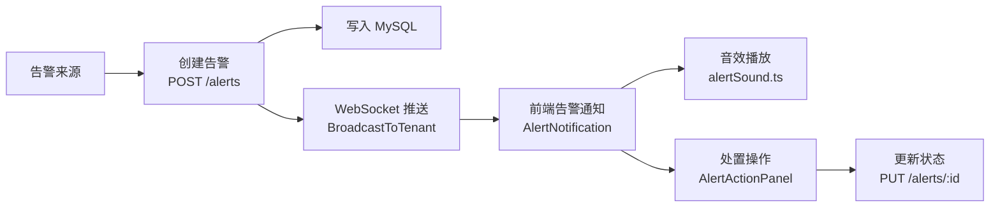

### 告警级别

| 级别 | 含义 |
|------|------|
| `INFO` | 信息提示 |
| `WARN` | 警告 |
| `CRIT` | 严重/紧急 |
| `OFFLINE` | 设备离线 |

---

## OpenClaw 智能协同系统

<details>
<summary>相关源文件</summary>

- `frontend/src/routes/OpenClawWorkspace.tsx` - 智能协同工作台
- `frontend/src/components/openclaw/OpenClawPanel.tsx` - AI 面板组件
- `frontend/src/components/openclaw/mockAssistant.ts` - Mock AI 助手
- `frontend/src/components/openclaw/openclawBridge.ts` - 事件桥接
- `frontend/src/store/contexts/OpenClawContext.tsx` - 上下文管理
- `frontend/src/store/api/openclawApi.ts` - RTK Query API
- `frontend/src/hooks/useContextualActions.ts` - 上下文动作 Hook
- `backend/internal/model/openclaw_mission.go` - 任务模型
- `backend/internal/service/openclaw.go` - OpenClaw 服务
- `backend/internal/handler/openclaw.go` - OpenClaw Handler
</details>

### 智能协同架构

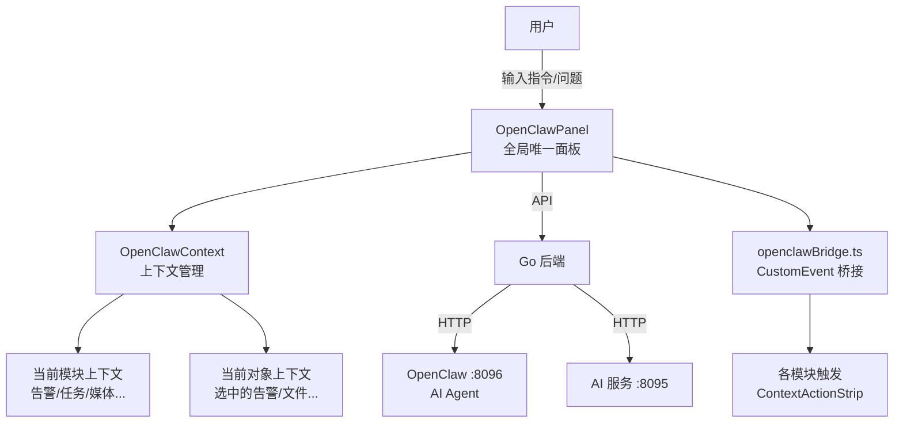

### 上下文感知

OpenClaw 面板会根据当前活跃模块自动调整行为：

| 模块 | 快速建议 |
|------|---------|
| 监控中枢 | 研判当前焦点画面、追溯关联资料、发布值班任务 |
| 媒体库 | 搜索今天的新资料、生成取证说明、整理事件链路 |
| 告警处置 | 分析当前告警根因、生成升级建议、补全交接摘要 |
| 任务协同 | 拆解当前待办、补全任务说明、回填执行摘要 |
| 资产设备 | 诊断当前设备、预测维护窗口、查询历史异常 |

---

## 构建系统

### 构建流水线

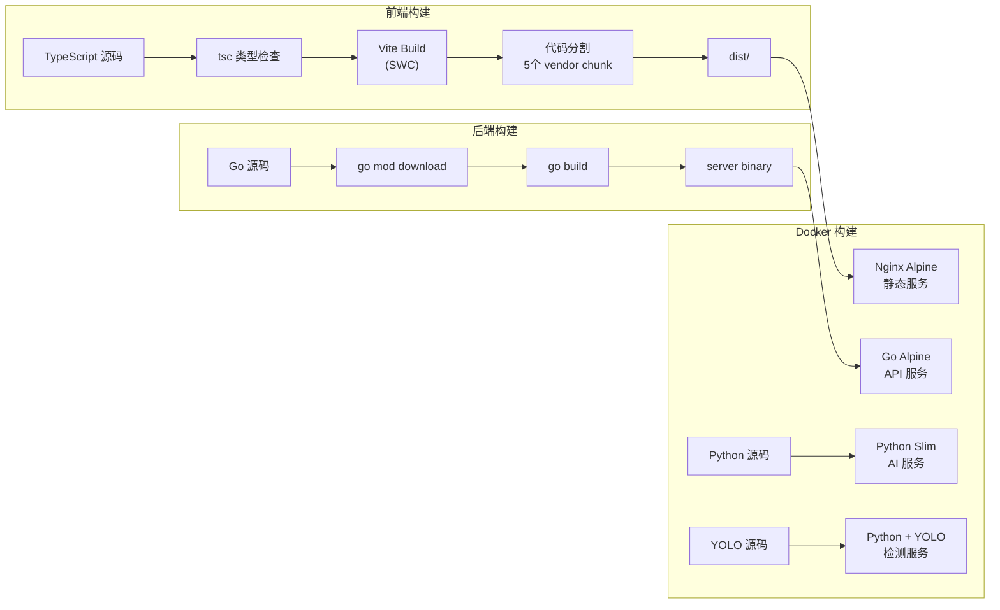

### 构建配置

| 项目 | 构建命令 | 说明 |
|------|---------|------|
| 前端 | `pnpm build` | tsc + Vite，max_old_space_size=4096 |
| 前端（快速） | `pnpm fast-build` | 跳过 tsc，仅 Vite |
| 后端 | `go build cmd/server/main.go` | Go 原生编译 |
| AI 服务 | Docker `pip install` | Python 依赖安装 |

---

## 测试基础设施

### 测试策略

| 测试类型 | 工具 | 覆盖范围 |
|---------|------|---------|
| 前端单元测试 | Vitest + jsdom | 组件、Hook、工具函数 |
| 前端组件测试 | Testing Library | React 组件交互测试 |
| 后端单元测试 | Go testing | Service 层业务逻辑 |
| 后端集成测试 | Go testing | API 端到端测试 |
| 后端性能测试 | Go benchmark | API 吞吐量基准 |
| YOLO 单元测试 | pytest | 检测器功能测试 |

### 测试命令

```
# 前端
pnpm test          # Vitest watch 模式
pnpm test:run      # Vitest 单次运行

# 后端
go test ./...                                    # 全部测试
go test ./internal/service/... -v                # Service 层测试
go test ./tests/integration/... -v               # 集成测试
go test ./tests/benchmark/... -bench=.           # 性能基准

# YOLO
pytest yolo-service/tests/
```

### 关键测试文件

| 文件 | 测试内容 |
|------|---------|
| `backend/internal/service/defect_case_test.go` | 缺陷案例服务 |
| `backend/internal/service/alert_test.go` | 告警服务 |
| `backend/internal/service/stream_test.go` | 视频流服务 |
| `backend/internal/service/auth_test.go` | 认证服务 |
| `backend/internal/service/media_test.go` | 媒体服务 |
| `backend/internal/handler/auth_test.go` | 认证 Handler |
| `backend/internal/handler/stream_test.go` | 视频流 Handler |
| `backend/pkg/config/env_test.go` | 环境配置 |
| `backend/pkg/response/errors_test.go` | 错误码体系 |
| `backend/tests/integration/api_test.go` | API 集成测试 |
| `backend/tests/benchmark/api_benchmark_test.go` | API 性能基准 |
| `frontend/src/components/ui/StatusBadge.test.tsx` | 状态徽章组件 |
| `yolo-service/tests/test_detector.py` | YOLO 检测器 |

---

## CI/CD 流水线

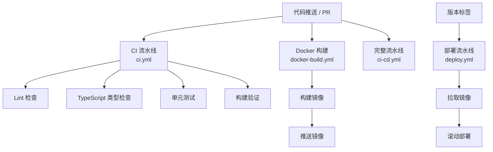

### CI/CD 配置文件

| 文件 | 用途 |
|------|------|
| `.github/workflows/ci.yml` | 持续集成 - lint/test/build |
| `.github/workflows/ci-cd.yml` | 完整 CI/CD 流水线 |
| `.github/workflows/docker-build.yml` | Docker 镜像构建 |
| `.github/workflows/deploy.yml` | 生产部署 |

---

## 部署架构

### Docker Compose 服务

| 服务 | 镜像 | 端口 | 依赖 |
|------|------|------|------|
| `mysql` | mysql:8.0 | 3306 | - |
| `redis` | redis:7-alpine | 6379 | - |
| `backend` | 自建 Go 镜像 | 8094 | mysql, redis, ai |
| `ai` | 自建 Python 镜像 | 8095 | - |
| `yolo` | 自建 Python 镜像 | 8097 | - |
| `openclaw` | openclaw/openclaw:latest | 8096 | - |
| `frontend` | Nginx Alpine | 3000→80 | - |

### 运维脚本

| 脚本 | 功能 |
|------|------|
| `dev-start.sh` | 一键启动开发环境 |
| `dev-stop.sh` | 停止开发环境 |
| `dev-health.sh` | 开发环境健康检查 |
| `scripts/deploy.sh` | 生产部署 |
| `scripts/rollback.sh` | 版本回滚 |
| `scripts/backup.sh` | 数据库备份 |
| `scripts/restore.sh` | 数据库恢复 |
| `scripts/load_test.sh` | 负载测试 |
| `scripts/start-all.sh` | 启动所有服务 |
| `scripts/stop-all.sh` | 停止所有服务 |

---

## 依赖管理

### 前端关键依赖

| 依赖 | 版本 | 用途 |
|------|------|------|
| react | ^18.2.0 | UI 框架 |
| react-router-dom | ^6.17.0 | SPA 路由 |
| @reduxjs/toolkit | ^1.9.5 | 状态管理 + RTK Query |
| tailwindcss | ^3.3.3 | 原子化 CSS |
| framer-motion | ^11.3.28 | 动画引擎 |
| lucide-react | ^0.483.0 | 图标库 |
| @radix-ui/react-slot | ^1.2.4 | 无障碍 UI 原语 |
| class-variance-authority | ^0.7.0 | 组件变体管理 |
| vite | ^4.4.5 | 构建工具 |
| vitest | ^1.2.0 | 测试框架 |

### 后端关键依赖

| 依赖 | 版本 | 用途 |
|------|------|------|
| gin-gonic/gin | v1.9.1 | HTTP 框架 |
| gorm.io/gorm | v1.30.0 | ORM |
| gorm.io/driver/mysql | v1.6.0 | MySQL 驱动 |
| golang-jwt/jwt/v5 | v5.3.1 | JWT 认证 |
| gorilla/websocket | v1.5.3 | WebSocket |
| redis/go-redis/v9 | v9.18.0 | Redis 客户端 |
| prometheus/client_golang | v1.23.2 | 监控指标 |
| golang.org/x/crypto | v0.41.0 | 密码哈希 |

### AI 服务关键依赖

| 依赖 | 版本 | 用途 |
|------|------|------|
| fastapi | 0.109.0 | Web 框架 |
| uvicorn | 0.27.0 | ASGI 服务器 |
| pydantic | 2.6.0 | 数据校验 |
| httpx | 0.26.0 | 异步 HTTP 客户端 |
| ultralytics | - | YOLOv8 推理引擎（YOLO 服务） |
| opencv-python | - | 图像处理（YOLO 服务） |

### 依赖策略

- 前端使用 pnpm 进行依赖管理，`pnpm-lock.yaml` 锁定版本
- 后端使用 Go Modules，`go.sum` 锁定依赖哈希
- Python 使用 `requirements.txt` 固定主版本号
- 所有 Docker 镜像指定具体版本标签（mysql:8.0、redis:7-alpine）

---

## 服务端口总览

| 服务 | 开发端口 | 容器端口 | 协议 |
|------|---------|---------|------|
| 前端 (Vite dev) | 5173 | - | HTTP |
| 前端 (Nginx) | 3000 | 80 | HTTP |
| Go API Gateway | 8094 | 8094 | HTTP + WS |
| AI 推理网关 | 8095 | 8095 | HTTP |
| YOLO 检测服务 | 8097 | 8097 | HTTP + WS |
| OpenClaw | 8096 | 8096 | HTTP |
| MySQL | 3306 | 3306 | TCP |
| Redis | 6379 | 6379 | TCP |

---

## 环境配置

### 关键环境变量

| 变量 | 必需 | 说明 |
|------|------|------|
| `DATABASE_URL` | 生产必需 | MySQL 连接字符串，未设置则使用 SQLite |
| `JWT_SECRET` | 生产必需 | JWT 签名密钥，至少 32 字符 |
| `MYSQL_ROOT_PASSWORD` | Docker 必需 | MySQL root 密码 |
| `MYSQL_PASSWORD` | Docker 必需 | MySQL 应用密码 |
| `OPENCLAW_URL` | 可选 | OpenClaw 服务地址 |
| `OPENCLAW_TOKEN` | 可选 | OpenClaw 认证 Token |
| `AI_SERVICE_URL` | 可选 | AI 服务地址，默认 http://localhost:8095 |
| `YOLO_SERVICE_URL` | 可选 | YOLO 服务地址，默认 http://localhost:8097 |
| `YOLO_DEVICE` | 可选 | YOLO 推理设备：cpu/cuda/mps |
| `AUTH_ENABLED` | 可选 | 是否启用认证，开发模式 false |
| `GIN_MODE` | 可选 | Gin 运行模式：release/debug |

---

## 质量检查清单

- [x] 包含项目概述与一句话定位
- [x] 技术栈表格完整准确
- [x] 仓库结构 Mermaid 图与实际匹配
- [x] 每个核心系统有独立章节
- [x] 每个章节有可折叠源文件引用
- [x] 模块依赖图正确反映实际依赖
- [x] 至少一个时序图展示核心流程
- [x] 所有表格格式正确内容准确
- [x] 代码块语法高亮正确
- [x] 无捏造的文件或模块
- [x] Mermaid 图语法正确可渲染
